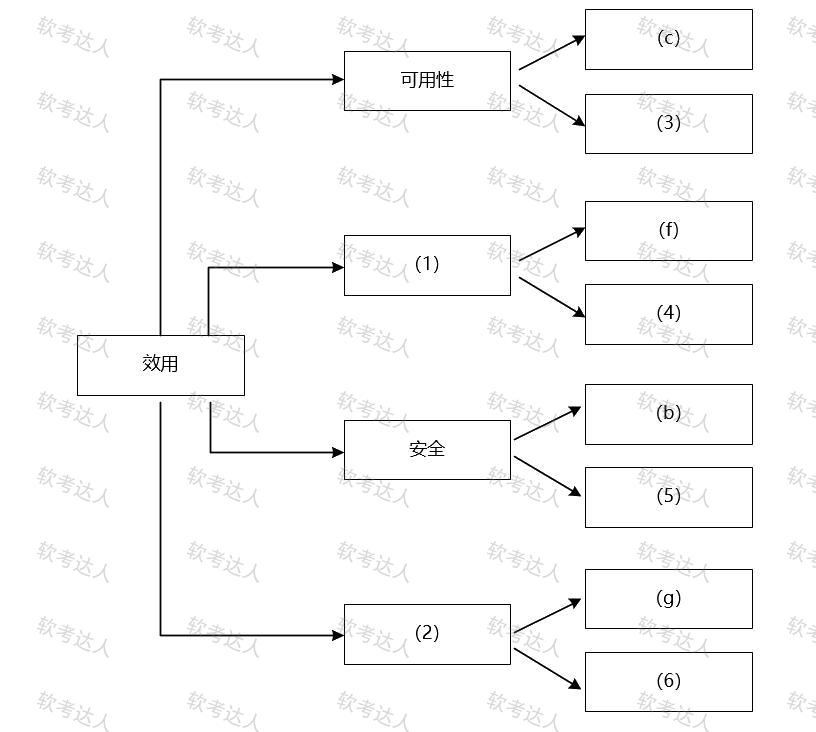

### 第1题 编程题

**阅读一**（25分）  
阅读下面关于软件架构设计与评估的文档，回答题目1和题目2。

【说明】
某公司拟开发一套机器学习应用开发平台，支持用户使用浏览器在线进行基于机器学习的智能应用开发活动。
该平台的核心应用场景是用户通过拖拽算法组件灵活定义机器学习流程，采用自助方式进行智能应用设计、实现与部署，并可以开发新算法组件加入平台中。在需求分析与架构设计阶段，公司提出的需求和质量属性描述如下:
 (a)平台用户分为算法工程师、软件工程师和管理员等三种角色，不同角色的功能界面有所不同； (b)平台应该具备数据库保护措施，能够预防核心数据库被非授权用户访问； (c)平台支持分布式部署,当主站点断电后，应在20秒内将请求重定向到备用站点； (d)平台支持初学者和高级用户两种界面操作模式，用户可以根据自己的情况灵活选择合适的模式； (e)平台主站点宕机后，需要在15秒内发现错误并启用备用系统； (f)在正常负载情况下，机器学习流程从提交到开始执行，时间间隔不大于5秒； (g)平台支持硬件扩容与升级，能够在3人天内完成所有部署与测试工作； (h)平台需要对用户的所有操作过程进行详细记录，便于审计工作； (i)平台部署后，针对界面风格的修改需要在3人天内完成; (j)在正常负载情况下，平台应在0.5秒内对用户的界面操作请求进行响应； (k)平台应该与目前国内外主流的机器学习应用开发平台的界面风格保持一致； (l)平台提供机器学习算法的远程调试功能，支持算法工程师进行远程调试。 
在对平台需求、质量属性描述和架构特性进行分析的基础上，公司的架构师给出了三种候选的架构设计方案，公司目前正在组织相关专家对平台架构进行评估。

---

**问题1**（9分）  
在架构评估过程中，质量属性效用树(utility tree)是对系统质量属性进行识别和优先级排序的重要工具。 请将合适的质量属性名称填入图1-1中(1)、(2)空白处，并从题干中的(a)-(i)中选择合适的质量属性描述,填入(3)-(6)空白处，完成该平台的效用树。

(1)性能

(2)可修改性

(3)e

(4)j

(5)h

(6)i

---

**问题2**（16分）  
针对该系统的功能，赵工建议采用解释器(interpreter)架构风格，李工建议采用管道过滤器(pipe-and-filter)的架构风格，王工则建议采用隐式调用(implicit invocation)架构风格。请针对平台的核心应用场景，从机器学习流程定义的灵活性和学习算法的可扩展性两个方面对三种架构风格进行对比与分析，并指出该平台更适合采用哪种架构风格。

解释器： 机器学习定义的灵活性高，可扩展能力强，因为解释器风格可以通过自定义流程规则及配套流程解释引擎开发，做到用户层面的流程完全定义，而不需要修改代码，所以无论是修改已有的业务流程，还是要扩展不同的角色，创建新角色的流程都非常便利

管道过滤器：机器学习流程定义的灵活性较低，可扩展能力较弱，因为管道过滤器是把数据处理职能做成过滤器，把数据传递做成管道，此时，如果流程不发生变化，是可以通过这种方式实现的，但一旦流程变化，或者扩展功能，需要对过滤器进行修改调整，或是看流程在程序层面重建，此时必须修改代码完成任务。

隐式调用，机器学习流程定义的灵活性一般，可扩展能力一般，隐式调用强调的是通过间接方式进行调用，如采用事件机制，要完成某个动作先触发事件，事件与相关动作关联，以提升灵活度，本题中可把角色执行业务的流程用事件触发。这种做法比管道过滤器强，但弱于完全自定义的解释器。